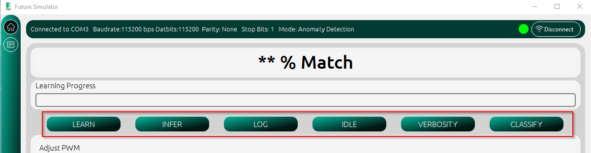
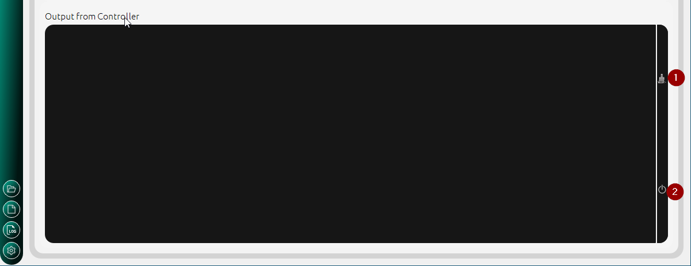

.. future simulator documentation master file, created by

Sending Commands to MCU
=========================

The MCU can be controlled remotely from the application by sending the desired commands. Each command is capable of altering the state machine in the MCU and/or 
changing the behaviour of the MCU. The application is capable of sending commands in three ways:

Command Options
----------------
1. Buttons: The user can send commands to put alter the state or behaviour of the MCU by clicking any of the 6 buttons. If the application is set to 
   Anomaly detection mode, the :guilabel:`CLASSIFY` button will be disabled. In Classification mode, the :guilabel:`LEARN`, and :guilabel:`INFER` are 
   disabled.

2. Command Line: Commands can be sent by typing specific commands to the MCU from the Command LineEdit. The commands must be any of the the following

.. list-table:: Command Table
   :widths: 5 10 30
   :header-rows: 1

   * - SN
     - Command
     - Description
   * - 1
     - 00
     - Sets the machine state to IDLE
   * - 2
     - 10
     - Sets the machine state to LOGGING
   * - 3
     - 20
     - Sets the machine state to LEARNING
   * - 4
     - 30
     - Sets the machine state to INFERENCE
   * - 5
     - 52
     - Sets the verbosity to HIGH. Debug messages will be sent by the MCU
   * - 6
     - 50
     - Sets the verbosity to LOW. Debug messages will not be sent by the MCU
   * - 7
     - 60
     - Sets the machine state to CLASSIFY

    Command line edit

3. PWM Slider: Moving the slider sends a PWM command to the MCU.

    PWM Slider

Receiving Data 
----------------
Data from the MCU is displayed in the Output Console. 

* To clear the buffer click on the button with the brush icon. 
* To disable output, click on the button with the power icon.
  

    Output from microcontroller
