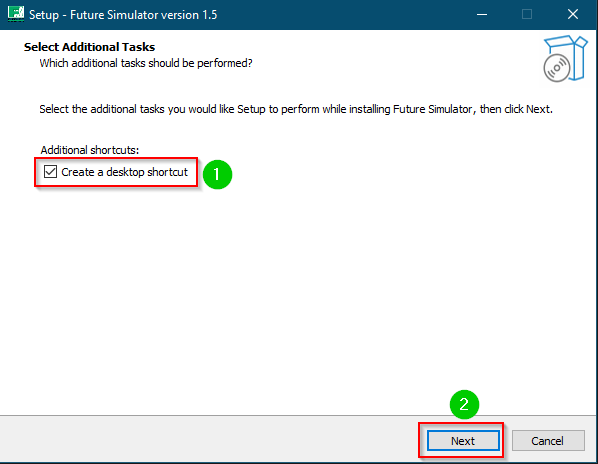
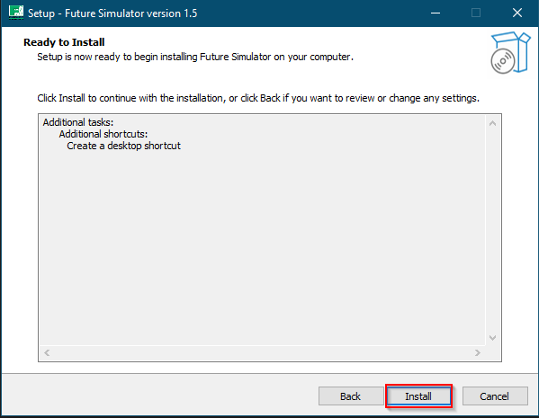
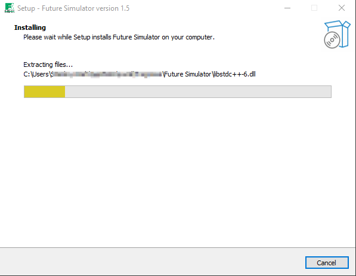
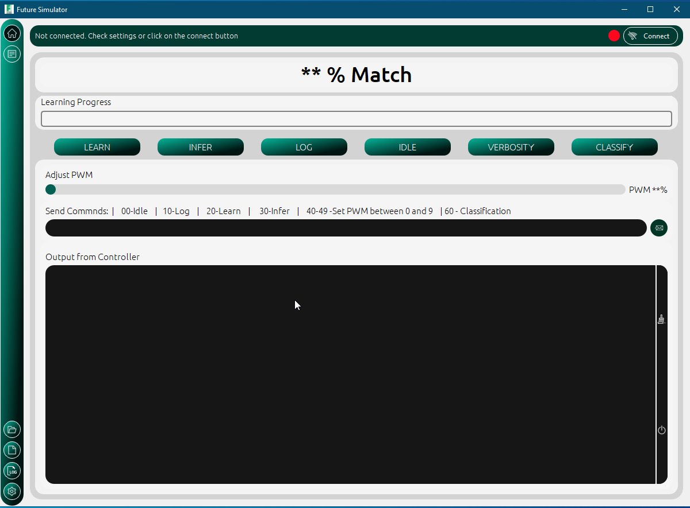

How to Install
===============

Requirements
-------------
Before installing the application, ensure that following conditions are met

* Operating system must be Windows 7/8/10
* At least 1 Gigabyte of random
* The PC must have at least 100Megabytes of free space

.. seealso:: 
    :doc:`./ai` 
    
    You might want to install the NanoEdge AI tool to use the generated logs.  

Installation
-------------

To install the future simulator app requires four simple steps, 

1. Download the installer file.

2. Double click on installer to start installation process

    Installation Step 1

3. Its optional to include shortcuts. Check the box if you would like to create a shortcut to the simulator

    Installation step 2

4. Click on the finish button after installation

    Installation step 3

5. Launch the application
   

    Installation step 4
   

  

