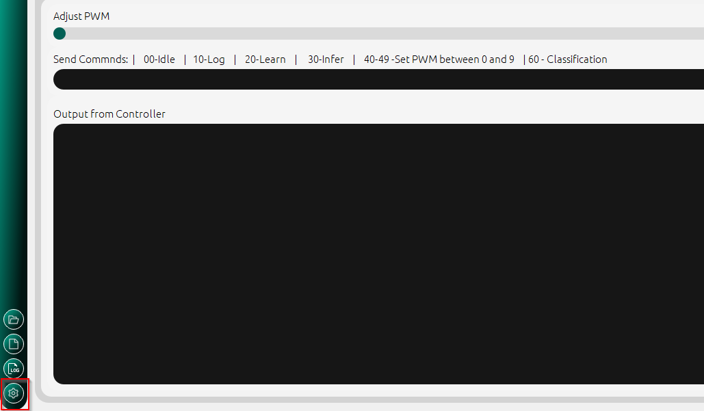
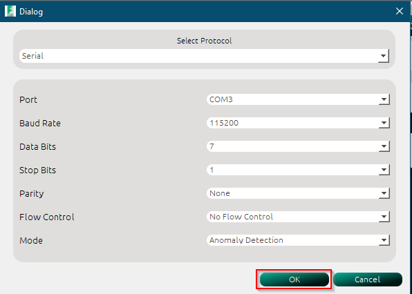
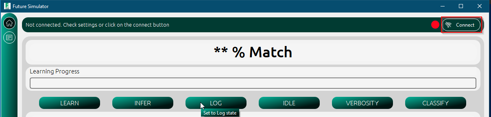
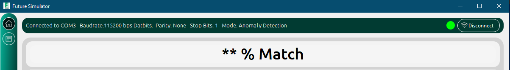
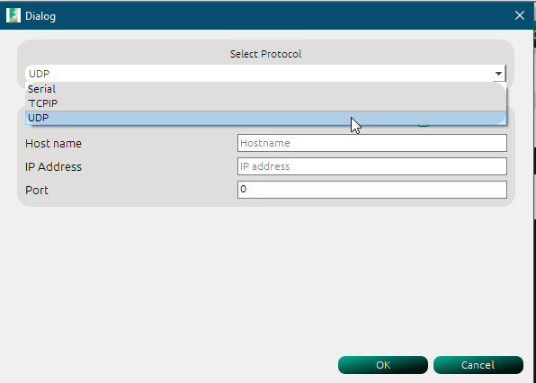
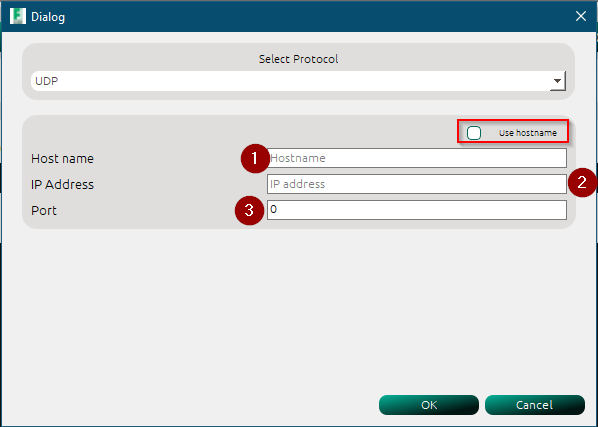
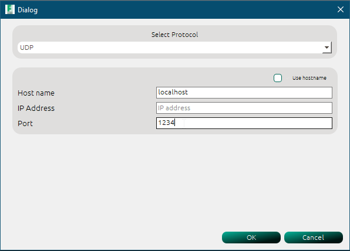
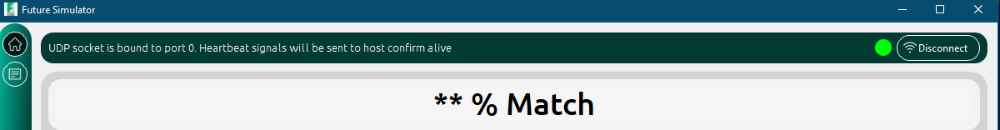
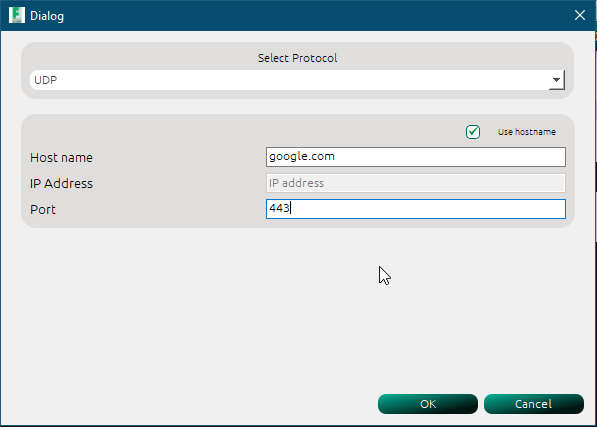
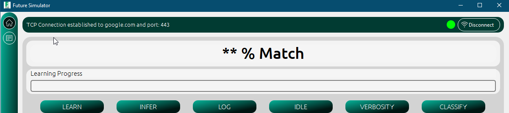

How to Establish connection
============================

The application can commnunicate with any microcontroller via three defined protocols

- Serial 
- Transport Contorl Protocol
- User Datagram Protocol

Serial Communication
---------------------
Data can be transmitted in full-duplex mode via serial protocol. The MCU must be configured to transmit serial data via USART or USB. In the absence
of this internal peripherals, the user can use an interface converter such as the FTDI converters or opt for the `TCP <>` or `UDP<>` options.
The first step is to confirm the connection parameters of the serial communication of the MCU. It is necessary to note the :guilabel:`baudrate`, :guilabel:`portnumber`,
:guilabel:`parity` :guilabel:`stopbits` and :guilabel:`databits` in order to configure the application.

To configure the application for serial communication, follow these steps

1. Click on the settings button

2. Click on the dropdown list to select Serial from the list of options

3. Click the OK button
4. Click the connect button
   

5. When connection is established, the parameters of the connection are displayed in the connection status bar  

UDP connection
---------------
UDP connection is established in the same way as the TCP connection. Since UDP is a connection-less protocol, only a UDP socket which is bound to the address
and port provided in the configuration as shown below.

1. Select UDP from the dropdown
   

2. Enter the ipadress or hostname of your PC.

.. tip:: 
    You can click on the ::guilabel:`use hostname` button to use only the hostname and not the ipadress. Ensure that when using this option, the hostname resolves 
    to a machine (pc) in the same domain as the pc running the application. You can choose to use :guilabel:`localhost` or :guilabel:`127.0.0.1` instead.

.. warning:: 
    Only one option can be used at a time. If the ::guilabel:`use hostname` checkbox is `checked`, then the IP address is greyed out. 
    You can only enter valid IP addresses in the ipadress lineedit. If the value entered is invalid, you cannot save the settings.
    A vaild IP address is contains 4 octects with values between 0-255 respectively.

3. Click Ok to save the settings
   

4. If previously connected via any of the available protocol, disconnect and reconnect. 
   

TCP connection
---------------

To establish TCP connection, follow these steps

1. Select UDP from the dropdown
   

2. Enter the ipadress or hostname of your PC.

3. Enter the IP address of the TCP server you would like to connect to 

4. Click OK and Connect button

With a valid connnection established, data commands can be sent using the configured media to the microncontroller.