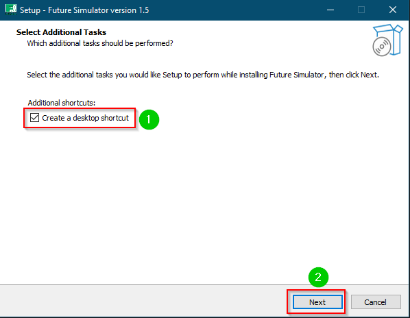
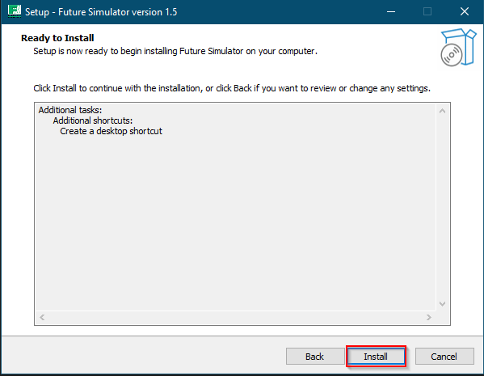
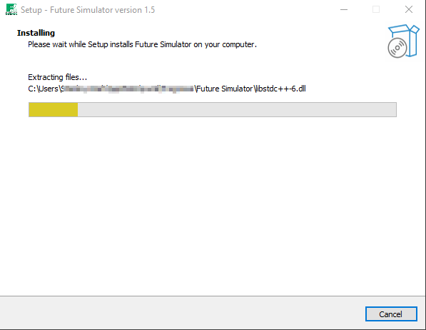
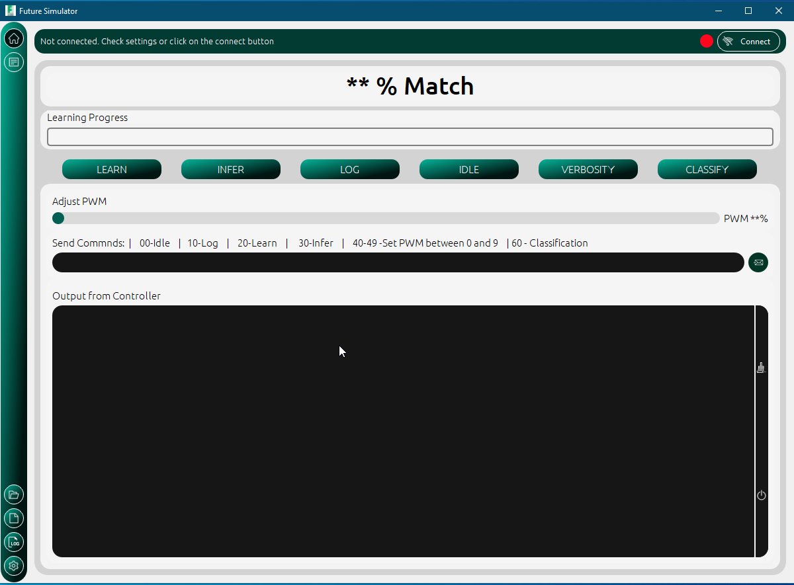

How to Install
===============

Requirements
-------------
Before installing the application, ensure that following conditions are met

- Operating system must be Windows 7/8/10
- At least 1 Gigabyte of random
- The PC must have at least 100Megabytes of free space

Installation
-------------

To install the future simulator app requires four simple steps, 

1 Download the installer file.

2 Double click on installer to start installation process

3 Its optional to include shortcuts. Check the box if you would like to create a shortcut to the simulator

4 Click on the finish button after installation

5. Launch the application
   

   

  

