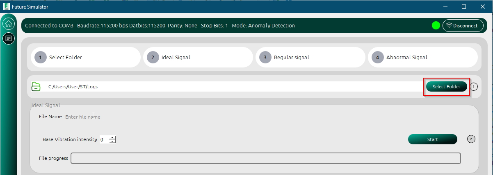
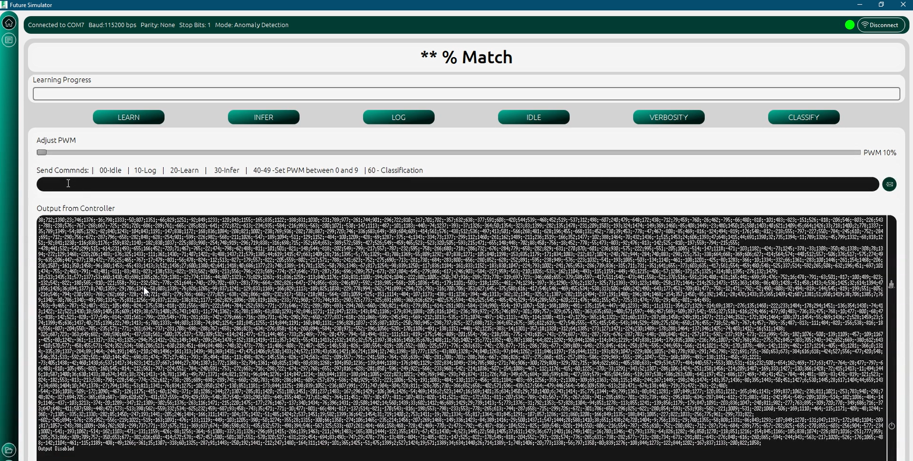
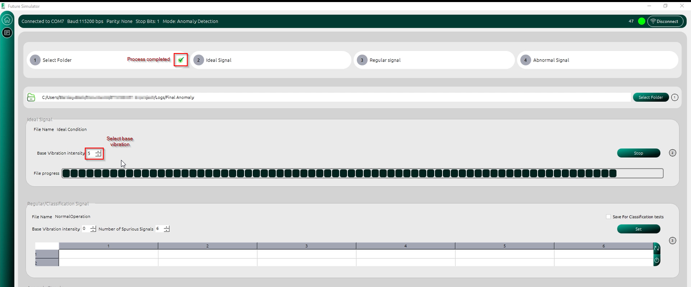
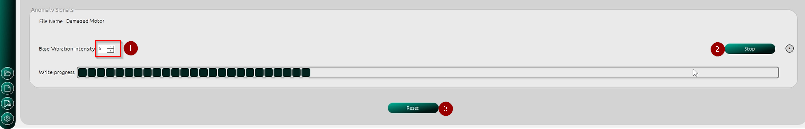

Logging Data From the Microcontroller
======================================

The simulator was originally created to capture and store data from onboard sensors on the STWIN-EVAL SensorTile board in CSV files. Depending on the
sample time configuration, the sensor (gyroscope, accelerometer, vibrometer) readings are generated in the microncontroller and sent via UART, USB, TCP
or UDP to the desktop app for logging. The vibration pattern of the attached vibration motor is detected by the sensor and processed by the MCU before being 
sent to the PC Simulator.
The CSV data is then used as a dataset for STMicroelectronic's `NanoEdgeAI <https://stm32ai.st.com/download-nanoedgeai/>`_
which is a useful tool for building and deploying AI models seamlessly.

.. seealso:: 
    To understand how the artificial intelligence tool is used watch this `demo <https://vimeo.com/794059375>`_ and refer to the 
    Artificial Intelligence Documentation.

Anomaly Detection
------------------
Because Anomaly detection requires two distinct data sets, the logging process must be done by following four steps. 

1. Select the folder where the log files will be saved
   

2. Generate a ideal signal without any variations in the vibration pattern. Select a :guilabel:`Base vibration intenity` that will be sent 
   automatically by the Simulator as a Pulse Width Modulation (PWM) command to the MCU. The MCU is also automatically set to logging state.
   The logged data can be viewed in real time in the Log screen as shown below

3. After the logs are generated, the user is notified via a tick on the screen. Preceed to generate Regular signals. Normal signals are considered
   to have intermittent spurious signals at random times. The Simulator generates random PWM values at random times between 0 and :guilabel:`logtime` and sends 
   these values to the the MCU while simulataneously logging the sensor values.

   * Set the number of times a spurious signal is generated withing the logging period by setting the :guilabel:`Number of spurious signals` combobox. 
   * Click on the  :guilabel:`Set` button to adjust the number of columns in the table.
   * Click on the :guilabel:`refresh` button to generate random PWM duty cycles at random change times. If you are not satisfied with the auto-generated
     values, click the button again
   * Click on the :guilabel:`power` button to start the logging process.

.. important:: 
    The :guilabel:`Save for Classification tests` is instructs the Simulator to save the generated vibration pattern for classification tests.
    More details about this will be discussed in the N-classification section. 

.. figure:: ./images/logging-regular-steps-to-take.png
    :width: 90%
    :align: center

4. Generate Anomaly Signals are generated by randomly sending PWMs greater than or equal to the :guilabel:`Base Vibration Intensity` to the MCU at varying 
   times. Remeber to set the file name for the log files, else a default name will be used.

N-classification
------------------

Generating logs for N-classification follows a similar process as the Anomaly detection. The user can decide to alter the vibration pattern specifically
to suit their needs before logging. When the :guilabel:`Save for Classification tests` box is checked, each vibration pattern is saved for test purposes.
During testing, the user can select any of the saved vibration patterns to be sent to the MCU for classification.
