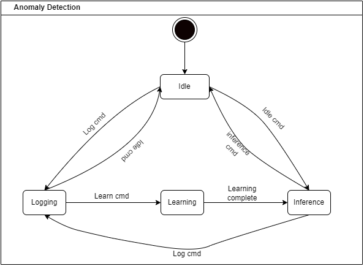

Setting Up the Microcontroller
===============================

The basic idea behind the project is to allow the user to control any MCU while simulataneously logging sensor data for build artificial intelligence 
models. The NanoEdgeAI tool makes the process of building, training and deploying AI models seamless. 

The software is designed as a state machine with four states

1. Idle 
2. Logging
3. N-classification 
4. Learning
5. Inference 

State machine for MCU

Idle State
-----------

In this state, the MCU does not read or send sensor data to the PC

Logging
--------
During logging, the MCU reads the sensor data, processes and stores it in a temporary buffer before sending it via the chosen medium/
In the Logging state, the MCU repeatedly calls the :guilabel:`log` function until any recognised state-change command is received.

.. c:function:: void Log(void)

    Captures data from from the vibrometer and stores it in a buffer before printing to stream. 
    The stream is captured by the chosed Internal Peripheral, in this case, it is the UART.

    :param (none): no parameters required
    :return: void
    :rtype: void

Learning
---------
The Learning state can be activated either from idle state or from logging state by sending the Learn command. In this state, the MCU calls the
:guilabel:`neai_anomalydetection_learn` api to train the machine learning model using live data from the buffer. For each learning iteration, the MCU calls
the :guilabel:`log` function.

.. c:function:: void learn(int learning_iterations)

    Called when the state is set to `learn`. The ::guilabel:`neai_anomalydetection_learn` takes in the buffer containing sensor data. 
    If the number of iterations is insufficient, error is sent to stream

    :param learning_iterations: Defines the number of times the neai_anomalydetection_learn api is called to train the model
    :type learning_iterations: int
    :return: void 

Inference
-----------

In inference state, the MCU calls the :guilabel:`neai_anomalydetection_inference` api to make deductions based on the current dataset in the buffer.
The api returns a percentage similarity between the data in the buffer and the trained model.

.. c:function:: void inference(void)

    Infers the similarity between the data in the :c:var:buffer and the trained model.

    :param: void
    :return: void

.. c:function:: void vibrationControl(char* vPWM)

    Receives the PWM commands from the PC application and sets the :guilabel:`__HAL_TIM_SET_COMPARE` in order to adjust the PWM

    :param: vPWM
    :type vPWM: char *
    :return: void

Import the Project to the STM32IDECube and build the project.

